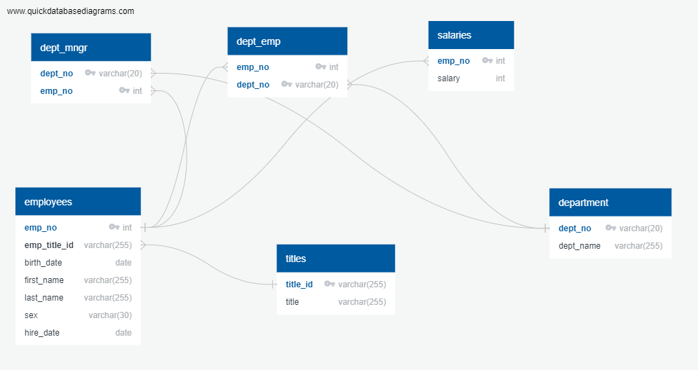
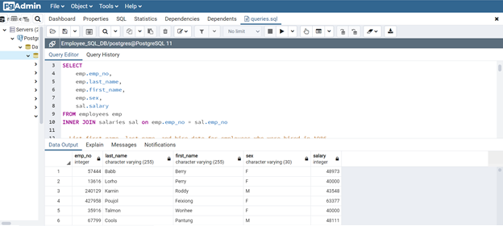
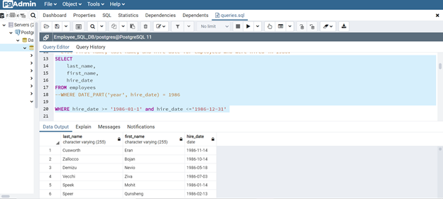
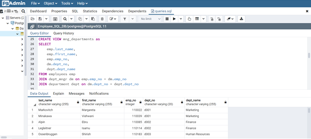
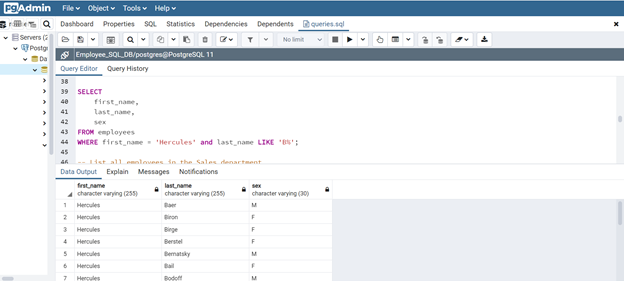
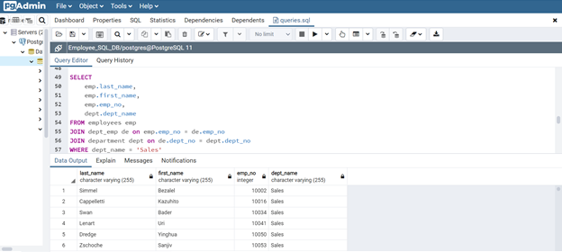
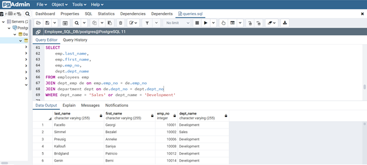
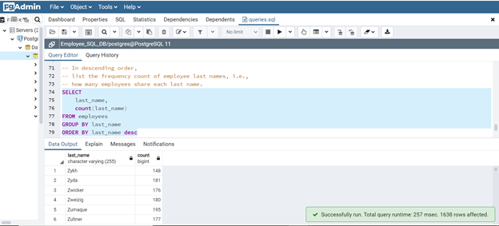

# PostgreSQL - Database Exploration

Tables are created to hold data from six CSV files. An ERD and table schema are created in order to run specific queries on all data. The focus of this project was specifically:

1. Data Engineering

2. Data Analysis

#### Data Modeling

After inspecting the CSVs, an ERD of the tables was designed. 

#### Data Engineering

* Using the information provided, a table schema was created for each of the six CSV files. 

#### Data Analysis

The following was analyzed using the data provided:

1. Details for each employee queried: employee number, last name, first name, sex, and salary

    

2. First name, last name, and hire date queried for all employees who were hired in 1986.

    

3. Queried for the manager of each department with the following information: department number, department name, the manager's employee number, last name, first name.

    

4. Ran query for the first name, last name, and sex for employees whose first name is "Hercules" and last names begin with "B."

    

5. Queried all employees in the Sales department, including their employee number, last name, first name, and department name.

    

6. Ran query for employees in the Sales and Development departments, including their employee number, last name, first name, and department name.

    

7. In descending order, ran a query to list the frequency count of employee last names, i.e., how many employees share each last name.

    
